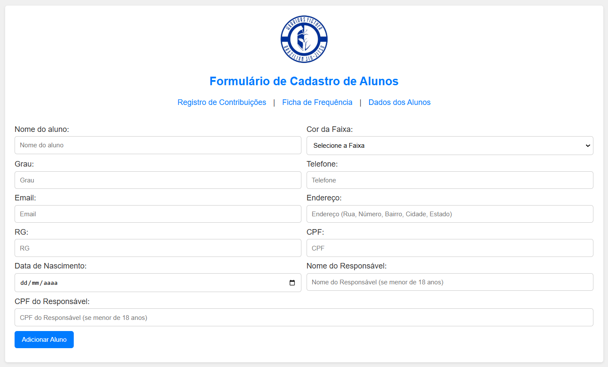
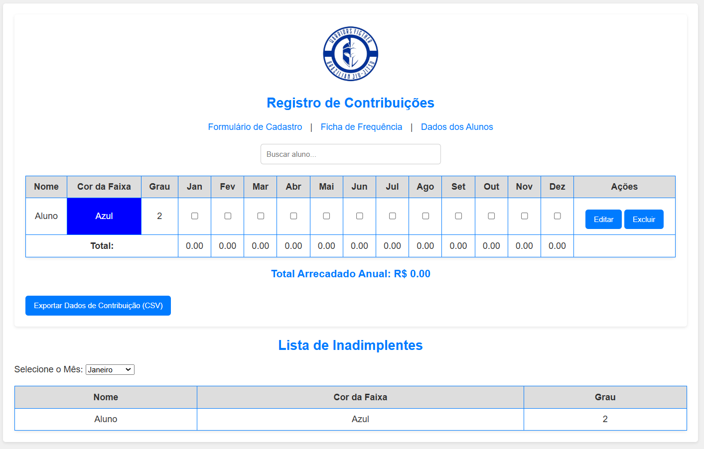
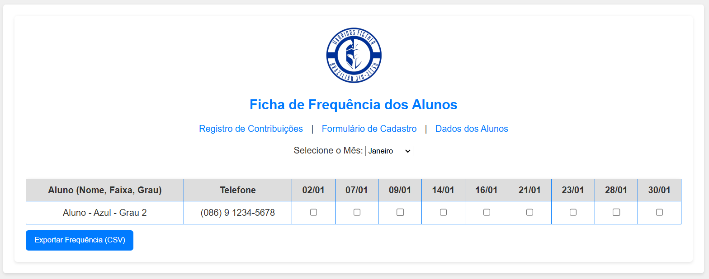

Warriors Fighter - Sistema de Gerenciamento de Alunos
Este projeto é um sistema web para gerenciamento de alunos de Brazilian Jiu-Jitsu. Ele foi desenvolvido para auxiliar instituições a manterem um controle eficaz sobre o cadastro dos alunos, registro de contribuições mensais, controle de frequência e acompanhamento de aniversariantes.

O sistema é desenvolvido usando HTML5, CSS3 e JavaScript (utilizando localStorage para persistência dos dados) e está organizado em páginas separadas para facilitar a manutenção e a evolução do código.

Funcionalidades
Tela de Login:

Acesso restrito com usuário WarriorsAdmin2025 e senha 2025warriorsAdmin.
Caso o login ou senha estejam incorretos, um popup exibe uma mensagem de erro.
Cadastro de Alunos (Index):

Formulário para cadastro dos alunos com validações robustas (CPF, email, etc.).
A data de nascimento é convertida para o formato DD/MM/AAAA.
Para a faixa preta, o campo de grau permite valores de 0 a 10; para as demais faixas, de 0 a 4.
Registro de Contribuições:

Exibição dos dados dos alunos (Nome, Faixa, Grau e status de pagamento de cada mês).
Edição inline dos dados essenciais (Nome, Faixa, Grau).
Marcação dos pagamentos via checkboxes.
Exportação dos dados para CSV e PDF.
Seção para listar os alunos inadimplentes por mês.
Ficha de Frequência:

Controle de presença dos alunos nas aulas (considerando as terças e quintas) com checkboxes.
Exportação da ficha de frequência em CSV e PDF.
Os estados dos checkboxes são mantidos mesmo após reordenação dos alunos, pois estão vinculados a um identificador único.
Lista de Registro:

Exibição dos dados completos dos alunos cadastrados.
Seção adicional para listar os aniversariantes do mês.
Estrutura do Projeto

/project-root
├── index.html                # Página de cadastro de alunos (Formulário)
├── contribuicoes.html        # Página de registro de contribuições
├── ficha_frequencia.html     # Página de controle de frequência
├── lista_registro.html       # Página de lista de registros de alunos e aniversariantes
├── login.html                # Página de login
├── css
│   └── style.css             # Arquivo de estilos (CSS) global
└── js
    ├── formulario.js         # Lógica do formulário de cadastro
    ├── contribuicoes.js      # Lógica para o registro de contribuições
    ├── ficha_frequencia.js   # Lógica para o controle de frequência
    ├── lista_registro.js     # Lógica para a lista de registros e aniversariantes
    └── login.js              # Lógica para a tela de login
Instruções de Uso
Clonando o Repositório

Abra seu terminal e execute:

# git clone https://github.com/MaykyCOliveira/AdmWarriorsFigtherBJJ.git
# cd warriors-fighter

Abrindo o Projeto

Como o sistema utiliza apenas tecnologias web front-end, basta abrir o arquivo login.html em seu navegador para iniciar o sistema.

Acesse login.html.
Utilize o login: WarriorsAdmin2025 e a senha: 2025warriorsAdmin.
Se o login for bem-sucedido, você será redirecionado para o formulário (index.html).
Cadastro de Alunos

Em index.html, preencha o formulário com os dados do aluno.
Verifique se os campos de email e CPF são válidos e se a data de nascimento está correta.
Após o cadastro, os dados são salvos no localStorage e podem ser consultados nas demais páginas.
Registro de Contribuições

Em contribuicoes.html, visualize e edite os dados dos alunos.
Marque ou desmarque os checkboxes para registrar o pagamento mensal.
Utilize as funções de exportação para gerar arquivos CSV ou PDF.
Veja a lista de alunos inadimplentes filtrada por mês.
Ficha de Frequência

Em ficha_frequencia.html, controle a presença dos alunos nas aulas (terças e quintas).
Exporte os dados de frequência conforme necessário.
Lista de Registro

Em lista_registro.html, visualize todos os registros dos alunos.
Uma seção adicional lista os aniversariantes do mês corrente.
Contribuição
Se desejar contribuir com este projeto, sinta-se à vontade para abrir issues ou enviar pull requests. Toda contribuição é bem-vinda!

Licença
Este projeto está licenciado sob a MIT License.

Considerações Finais
Este sistema é um exemplo prático de como organizar um projeto web utilizando HTML, CSS e JavaScript com separação de responsabilidades. Ele pode ser expandido conforme as necessidades, por exemplo, integrando com um back-end para persistência dos dados em um banco de dados.
